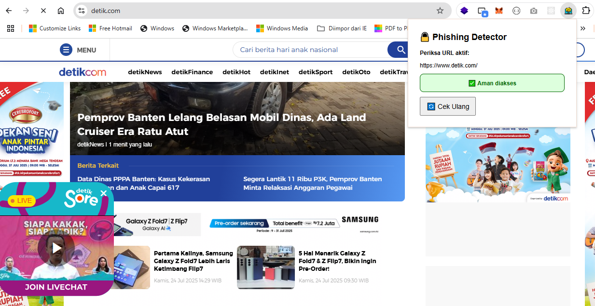
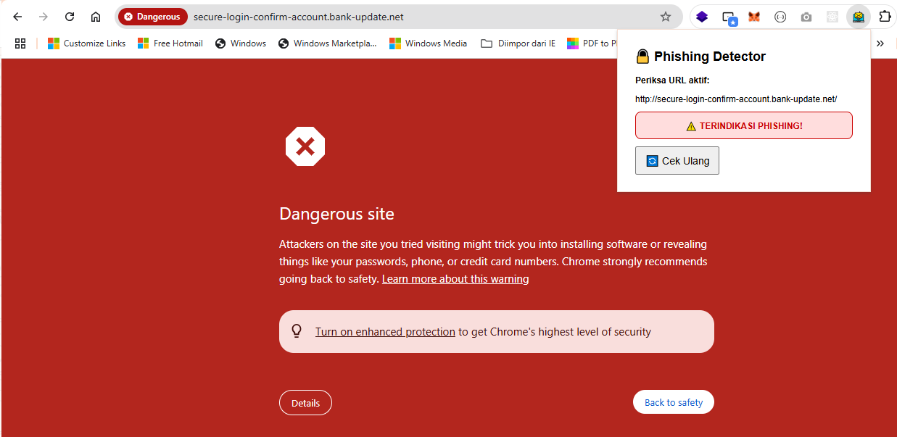

# 🚨 Anti-Phishing URL Detector Extension (MVP)

Ekstensi Chrome sederhana yang mendeteksi potensi phishing pada URL halaman yang sedang dibuka. Dirancang untuk bekerja sepenuhnya offline (tanpa internet dan API), dengan model ringan berbasis Machine Learning (Logistic Regression). Versi selanjutnya dapat diintegrasikan dengan backend Flask untuk inference yang lebih kompleks dan akurat.

---

## 📦 Fitur

- ✅ Deteksi phishing berbasis model ML sederhana (offline)
- ✅ Popup edukatif yang menunjukkan status URL
- ✅ UI ringan dan minimalis
- ✅ Tanpa internet, cocok untuk MVP/demo awal
- 🔜 Rencana integrasi backend Flask untuk inference lebih akurat

---

## 🚀 Cara Menjalankan Ekstensi

1. Buka Chrome, masuk ke: `chrome://extensions/`
2. Aktifkan `Developer mode` (di kanan atas)
3. Klik `Load unpacked`
4. Arahkan ke folder `anti-phishing-extension/`
5. Ekstensi akan muncul dengan ikon 🛡️ (icon.png)

---

## 🔍 Cara Kerja

1. Saat user membuka tab baru, `background.js` akan meng-capture URL.
2. URL tersebut dikirim ke `popup.js` ketika popup dibuka.
3. Model Logistic Regression (yang dilatih sebelumnya) melakukan prediksi lokal terhadap URL.
4. Hasil prediksi ditampilkan di `popup.html` dengan status:
   - **AMAN ✅** — URL kemungkinan besar tidak berbahaya
   - **WASPADA ⚠️** — URL terindikasi phishing

---

## 🧪 Hasil Pengujian

| Status                        | Contoh Tampilan                                                  |
|------------------------------|-------------------------------------------------------------------|
| ✅ URL Aman                  |                  |
| ⚠️ Terindikasi Phishing     |                 |

---

## 🛠️ Teknologi yang Digunakan

- HTML, CSS, JavaScript
- Logistic Regression (scikit-learn)
- Model vectorizer (TF-IDF)
- Chrome Extension APIs

---

## 📌 Catatan

- Model `.pkl` sudah dilatih sebelumnya dan bersifat statis.
- Untuk inference yang lebih kompleks atau update model secara berkala, dapat diintegrasikan dengan Flask backend.
- File `.pkl` bisa diganti dengan model lain asal tetap kompatibel dengan `popup.js`.

---

## 📈 Rencana Iterasi Selanjutnya

- [ ] Tambah Flask backend untuk inference
- [ ] Update model dengan dataset baru
- [ ] Logging URL untuk pelatihan ulang (dengan izin user)
- [ ] Notifikasi real-time jika terdeteksi phishing

---

## 🧑‍💻 Kontributor

- Eka Prasetyo — Developer & Trainer  
- Dibuat sebagai bagian dari MVP untuk edukasi keamanan siber

---

## 📝 Lisensi

Proyek ini open-source dan bebas digunakan untuk keperluan edukasi.

---
